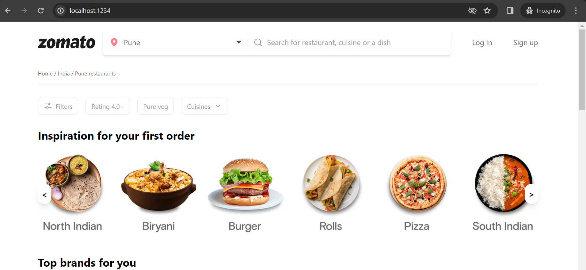
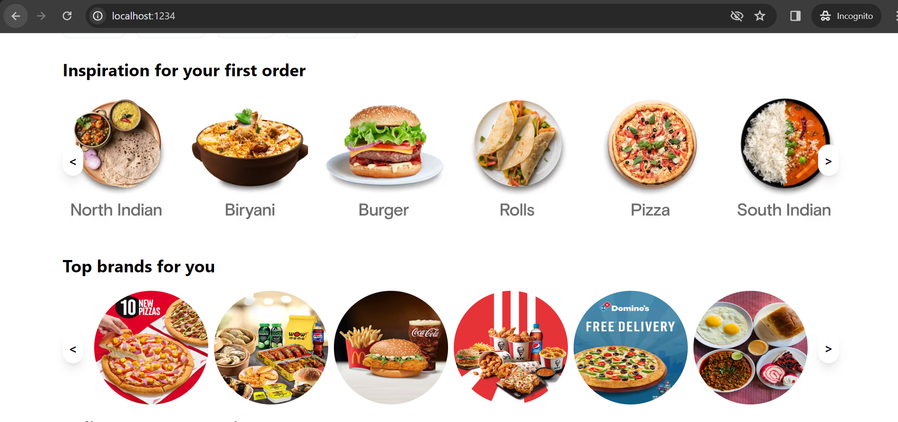
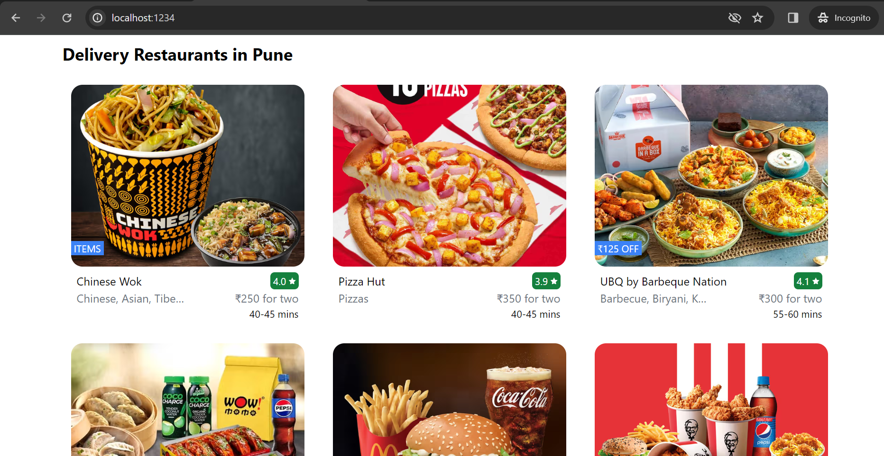

# Food ordering app (Zomato replica)

This project is a replica of the Zomato website, built using React and Tailwind CSS. It is currently a work in progress, with approximately 30% of the development completed.

## Project Status

Please note that this project is still under development. Features and pages are being added progressively. The current version only includes a limited set of functionalities.

## Technologies Used

- React
- Tailwind CSS

## Project Screenshots

